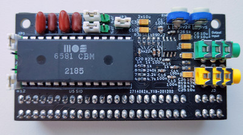

## ZX-TSid
MOS SID sound card for ZX Spectrum edge connector (ZX-BUS).

 

PCB is compatible with SID 6581 and 8580, but also contains integrated SwinSID emulator.

SID accessible via #xxCF port, where xx - SID's register number.

You may connect your ZX Spectrum audio output to second 3.5mm jack and it will be mixed in sound card output signal.

### Changelog & current status
* Rev.A - initial release with SID, AY and Covox. [Errata](pcb/rev.A/ERRATA.txt).
* Rev.B - abandoned. Files kept for historical reason.
* Rev.C - removed AY and Covox. Added SwinSID emulator. PCB is vertical oriented now.
* Rev.D - improved signal-noise ratio. Fixed read from SID chip.

TODO:
* Check with real SID chip;
* Further improve signal-noise ratio.
